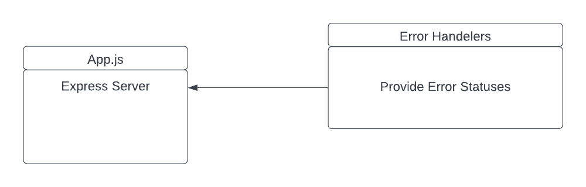

# LAB - 01

## Server Deployment Practice

### Author: Hayden Cleaver

- [tests report](https://github.com/HaydenCleaver/server-deployment-practice/actions)
- [heroku-dev](https://hayden-server-deploy-dev.herokuapp.com/)
- [heroku-main](https://hayden-server-deploy-prod.herokuapp.com/)
### Setup

#### `.env` requirements

- `PORT` - 3002

#### Running the app

- `npm start`
- Endpoint: `/`
  - Returns 'Hello World'

#### Tests

- Unit Tests: `npm run test`

#### UML

(Created with [lucid-chart](https://www.lucidchart.com/blog/types-of-UML-diagrams))

